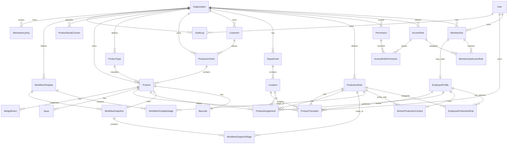

# DATABASE.md

## 1. Purpose

This document defines the initial relational database model for FactoryFlow.

The database must preserve:

- strict tenant isolation
- current Product state
- current responsibility
- current location
- production workflow history
- immutable Product history
- authorization data
- auditability
- concurrency safety for scan and transfer operations

PostgreSQL is the primary database.

Prisma is the initial ORM and migration tool.

## 2. Database design principles

1. Use UUID primary keys for internal identifiers.
2. Keep human-readable numbers separate from internal IDs.
3. Every tenant-owned record contains `organizationId`.
4. Use foreign keys and unique constraints to protect invariants.
5. Current Product state is stored for fast reads.
6. Historical events are stored separately and are append-only.
7. Access authorization and production work roles are separate concepts.
8. Scan and transfer mutations use database transactions.
9. Decimal values are used for material measurements.
10. Soft lifecycle states such as `TRASHED` are not physical deletion.

## 3. Core entity groups

### Tenant and identity

- Organization
- User
- Membership
- AccessRole
- Permission
- MembershipAccessRole
- AccessRolePermission
- EmployeeProfile

### Production configuration

- ProductionRole
- EmployeeProductionRole
- WorkerProductionContext
- Department
- Location
- WorkflowTemplate
- WorkflowTemplateStage
- WorkflowSnapshot
- WorkflowSnapshotStage

### Business data

- Customer
- ProductionOrder
- ProductType
- Product
- Barcode

### Tracking and history

- ProductAssignment
- ProductTransition
- Issue
- WeightEvent
- AuditLog
- IdempotencyKey

## 4. ERD



## 5. Table definitions

## Organization

Represents one factory tenant.

Suggested columns:

```text
id                  UUID PK
name                VARCHAR NOT NULL
slug                VARCHAR NOT NULL
createdAt           TIMESTAMPTZ NOT NULL
updatedAt           TIMESTAMPTZ NOT NULL
```

Constraints:

```text
UNIQUE(slug)
```

## User

Represents an authenticated identity.

Suggested columns:

```text
id                  UUID PK
username            VARCHAR NULL
email               VARCHAR NULL
passwordHash        VARCHAR NULL
isActive            BOOLEAN NOT NULL DEFAULT true
isSystemAdmin       BOOLEAN NOT NULL DEFAULT false
createdAt           TIMESTAMPTZ NOT NULL
updatedAt           TIMESTAMPTZ NOT NULL
```

Authentication-provider-specific fields may be added by the authentication implementation.

Do not store authorization directly on User.

`isSystemAdmin` is the MVP platform-level capability flag. It is not an
Organization `AccessRole`, and normal tenant users default to `false`. A future
platform authorization model may replace this flag when the product requires
more than one platform-level capability.

When present, `email` and `username` are globally unique. PostgreSQL permits
multiple `NULL` values under these unique constraints.

## Membership

Connects a User to one Organization.

Suggested columns:

```text
id                  UUID PK
organizationId      UUID FK -> Organization.id
userId              UUID FK -> User.id
status              VARCHAR NOT NULL
createdAt           TIMESTAMPTZ NOT NULL
updatedAt           TIMESTAMPTZ NOT NULL
```

Constraints:

```text
UNIQUE(organizationId, userId)
UNIQUE(organizationId, id, userId)
```

Tenant-scoped actor records retain both the User identity and the Membership
that proves the User belongs to the Organization. Composite foreign keys use
`(organizationId, membershipId, userId)` for this purpose.

## AccessRole

Authorization role inside an Organization.

Examples:

```text
Factory Admin
Production Manager
Worker
Quality Control
Viewer
```

Suggested columns:

```text
id                  UUID PK
organizationId      UUID FK -> Organization.id
code                VARCHAR NOT NULL
name                VARCHAR NOT NULL
isSystemDefined     BOOLEAN NOT NULL DEFAULT false
createdAt           TIMESTAMPTZ NOT NULL
updatedAt           TIMESTAMPTZ NOT NULL
```

Constraints:

```text
UNIQUE(organizationId, code)
```

## Permission

Represents one authorization capability.

Suggested columns:

```text
id                  UUID PK
code                VARCHAR NOT NULL
description         VARCHAR NULL
createdAt           TIMESTAMPTZ NOT NULL
```

Examples:

```text
products.create
products.read
products.update
products.complete
scans.perform
issues.create
users.manage
audit.read
```

Permissions are expected to be platform-defined.

## AccessRolePermission

Many-to-many relationship between AccessRole and Permission.

Suggested columns:

```text
accessRoleId        UUID FK -> AccessRole.id
permissionId        UUID FK -> Permission.id
createdAt           TIMESTAMPTZ NOT NULL
```

Constraints:

```text
PRIMARY KEY(accessRoleId, permissionId)
```

## MembershipAccessRole

Assigns AccessRoles to a Membership.

Suggested columns:

```text
membershipId        UUID FK -> Membership.id
accessRoleId        UUID FK -> AccessRole.id
createdAt           TIMESTAMPTZ NOT NULL
```

Constraints:

```text
PRIMARY KEY(membershipId, accessRoleId)
```

The application must verify that Membership and AccessRole belong to the same Organization.

## EmployeeProfile

Represents the factory employee/business identity attached to a Membership.

Suggested columns:

```text
id                  UUID PK
organizationId      UUID FK -> Organization.id
membershipId        UUID FK -> Membership.id
displayName         VARCHAR NOT NULL
isActive            BOOLEAN NOT NULL DEFAULT true
createdAt           TIMESTAMPTZ NOT NULL
updatedAt           TIMESTAMPTZ NOT NULL
```

Constraints:

```text
UNIQUE(organizationId, membershipId)
```

## ProductionRole

Represents a production function.

Examples:

```text
POLISHER
STONE_SETTER
CLEANER
QUALITY_INSPECTOR
```

Suggested columns:

```text
id                  UUID PK
organizationId      UUID FK -> Organization.id
code                VARCHAR NOT NULL
name                VARCHAR NOT NULL
isActive            BOOLEAN NOT NULL DEFAULT true
createdAt           TIMESTAMPTZ NOT NULL
updatedAt           TIMESTAMPTZ NOT NULL
```

Constraints:

```text
UNIQUE(organizationId, code)
```

## EmployeeProductionRole

Defines which ProductionRoles an employee may perform.

Suggested columns:

```text
organizationId     UUID FK -> Organization.id
employeeId          UUID FK -> EmployeeProfile.id
productionRoleId    UUID FK -> ProductionRole.id
handlingLocationId  UUID NULL FK -> Location.id
createdAt           TIMESTAMPTZ NOT NULL
```

Constraints:

```text
PRIMARY KEY(employeeId, productionRoleId)
INDEX(organizationId, handlingLocationId)
```

`handlingLocationId` belongs to the employee/ProductionRole assignment
rather than to the reusable ProductionRole. The composite foreign key
`(organizationId, handlingLocationId)` prevents a role assignment from
pointing at another tenant's Location. A missing or inactive handling
Location makes the worker context unavailable for scanning. The server
revalidates the role assignment and Location immediately before each scan
transaction.

## WorkerProductionContext

Stores the current production working context for an EmployeeProfile. It is
not an authorization record and does not grant any Permission.

```text
id                     UUID PK
organizationId         UUID FK -> Organization.id
employeeId             UUID FK -> EmployeeProfile.id
activeProductionRoleId UUID NULL FK -> ProductionRole.id
createdAt              TIMESTAMPTZ NOT NULL
updatedAt              TIMESTAMPTZ NOT NULL
```

Constraints and indexes:

```text
UNIQUE(organizationId, employeeId)
INDEX(organizationId, activeProductionRoleId)
```

The composite foreign keys require the EmployeeProfile and optional
ProductionRole to belong to the same Organization. The application must also
verify that the active role is assigned to that employee and is active before
persisting or using it. A single available role may be resolved automatically
without creating a context row; multiple roles require an explicit selection.

## Department

Represents a factory department.

Suggested columns:

```text
id                  UUID PK
organizationId      UUID FK -> Organization.id
code                VARCHAR NOT NULL
name                VARCHAR NOT NULL
isActive            BOOLEAN NOT NULL DEFAULT true
createdAt           TIMESTAMPTZ NOT NULL
updatedAt           TIMESTAMPTZ NOT NULL
```

Constraints:

```text
UNIQUE(organizationId, code)
```

## Location

Represents a physical or logical Product location.

Suggested columns:

```text
id                  UUID PK
organizationId      UUID FK -> Organization.id
departmentId        UUID NULL FK -> Department.id
code                VARCHAR NOT NULL
name                VARCHAR NOT NULL
type                VARCHAR NOT NULL
isActive            BOOLEAN NOT NULL DEFAULT true
createdAt           TIMESTAMPTZ NOT NULL
updatedAt           TIMESTAMPTZ NOT NULL
```

Possible types:

```text
DEPARTMENT
WORK_AREA
SAFE
STORAGE
WAITING
EXTERNAL
OTHER
```

Constraints:

```text
UNIQUE(organizationId, code)
```

## Customer

Suggested columns:

```text
id                  UUID PK
organizationId      UUID FK -> Organization.id
name                VARCHAR NOT NULL
externalReference   VARCHAR NULL
createdAt           TIMESTAMPTZ NOT NULL
updatedAt           TIMESTAMPTZ NOT NULL
```

## ProductionOrder

Suggested columns:

```text
id                  UUID PK
organizationId      UUID FK -> Organization.id
customerId          UUID NULL FK -> Customer.id
orderNumber         VARCHAR NOT NULL
status              VARCHAR NOT NULL
commitmentAt        TIMESTAMPTZ NULL
createdAt           TIMESTAMPTZ NOT NULL
updatedAt           TIMESTAMPTZ NOT NULL
```

Constraints:

```text
UNIQUE(organizationId, orderNumber)
```

## ProductType

Represents a configurable type/model classification.

Suggested columns:

```text
id                  UUID PK
organizationId      UUID FK -> Organization.id
code                VARCHAR NOT NULL
name                VARCHAR NOT NULL
isActive            BOOLEAN NOT NULL DEFAULT true
createdAt           TIMESTAMPTZ NOT NULL
updatedAt           TIMESTAMPTZ NOT NULL
```

Constraints:

```text
UNIQUE(organizationId, code)
```

Jewelry-specific configuration may later be modeled through type-specific metadata without contaminating the core workflow model.

## Product

Represents one individually tracked physical production unit.

Suggested columns:

```text
id                  UUID PK
organizationId      UUID FK -> Organization.id
productionOrderId   UUID NULL FK -> ProductionOrder.id
productTypeId       UUID NULL FK -> ProductType.id

serialNumber        VARCHAR NOT NULL
status              ProductStatus NOT NULL

currentWorkerId     UUID NULL FK -> EmployeeProfile.id
currentRoleId       UUID NULL FK -> ProductionRole.id
currentLocationId   UUID NULL FK -> Location.id
currentStageId      UUID NULL

isUrgent            BOOLEAN NOT NULL DEFAULT false
targetAt            TIMESTAMPTZ NULL
completedAt         TIMESTAMPTZ NULL
cancelledAt         TIMESTAMPTZ NULL
trashedAt           TIMESTAMPTZ NULL

version             INTEGER NOT NULL DEFAULT 0

createdAt           TIMESTAMPTZ NOT NULL
updatedAt           TIMESTAMPTZ NOT NULL
```

Initial `ProductStatus` values:

```text
CREATED
IN_PROGRESS
READY_FOR_HANDOFF
COMPLETED
CANCELLED
TRASHED
```

Constraints:

```text
UNIQUE(organizationId, serialNumber)
```

Important:

`status`, `currentWorkerId`, `currentRoleId`, and `currentLocationId` are intentionally separate.

`version` is the optimistic concurrency token for Product receive, takeover,
Finish, completion, return-to-process, cancellation, restoration, and logical
trash. Every state-changing operation updates the Product with a predicate
containing the expected version and rejects a zero-row update as a conflict.

`currentStageId` references `WorkflowSnapshotStage` together with the Product
identity. The database therefore requires the stage to belong to the
WorkflowSnapshot assigned to that same Product.

## ProductSerialCounter

Allocates human-readable Product serials without a concurrent count/latest
race.

Columns:

```text
organizationId      UUID FK -> Organization.id
year                INTEGER
lastValue           INTEGER NOT NULL DEFAULT 0
```

Constraints:

```text
PRIMARY KEY(organizationId, year)
```

Product creation atomically upserts this row for the current UTC Gregorian
year and increments `lastValue`. The resulting serial format is
`PRD-YYYY-######`, with a maximum value of `999999` for each tenant/year.
Existing serials matching this format are used to initialize the counter when
the migration is applied.

## Barcode

One Product has one active barcode identity in the initial model.

Suggested columns:

```text
id                  UUID PK
organizationId      UUID FK -> Organization.id
productId           UUID FK -> Product.id
value               VARCHAR NOT NULL
format              VARCHAR NULL
createdAt           TIMESTAMPTZ NOT NULL
lastPrintedAt       TIMESTAMPTZ NULL
```

Constraints:

```text
UNIQUE(value)
UNIQUE(productId)
```

The Phase 5 Product creation flow generates a globally unique, non-sequential
`ff_` value from cryptographically secure random bytes. The barcode value must
not be a sequential Product ID or a serial number. Symbology and printing are
deferred until the scanner/printer standard is approved.

## WorkflowTemplate

Suggested columns:

```text
id                  UUID PK
organizationId      UUID FK -> Organization.id
name                VARCHAR NOT NULL
version             INTEGER NOT NULL
isActive            BOOLEAN NOT NULL DEFAULT true
createdAt           TIMESTAMPTZ NOT NULL
updatedAt           TIMESTAMPTZ NOT NULL
```

Constraints:

```text
UNIQUE(organizationId, name, version)
```

## WorkflowTemplateStage

Suggested columns:

```text
id                  UUID PK
organizationId      UUID FK -> Organization.id
workflowTemplateId  UUID FK -> WorkflowTemplate.id
productionRoleId    UUID NULL FK -> ProductionRole.id
code                VARCHAR NOT NULL
name                VARCHAR NOT NULL
position            INTEGER NULL
createdAt           TIMESTAMPTZ NOT NULL
updatedAt           TIMESTAMPTZ NOT NULL
```

Constraints:

```text
UNIQUE(workflowTemplateId, code)
```

`position` is advisory and does not mean the workflow is strictly linear.
Phase 9 application validation requires positive, unique positions and unique
codes within each immutable template version. The existing database schema is
unchanged; no Phase 9 migration is required.

## WorkflowSnapshot

Preserved workflow assigned to a Product.

Suggested columns:

```text
id                  UUID PK
organizationId      UUID FK -> Organization.id
productId           UUID FK -> Product.id
sourceTemplateId    UUID NULL FK -> WorkflowTemplate.id
sourceVersion       INTEGER NULL
createdAt           TIMESTAMPTZ NOT NULL
```

Constraints:

```text
UNIQUE(productId)
```

## WorkflowSnapshotStage

Immutable stage definition inside a Product workflow snapshot.

Suggested columns:

```text
id                  UUID PK
organizationId      UUID FK -> Organization.id
workflowSnapshotId  UUID FK -> WorkflowSnapshot.id
productId           UUID FK -> Product.id through WorkflowSnapshot
productionRoleId    UUID NULL FK -> ProductionRole.id
sourceStageId       UUID NULL
code                VARCHAR NOT NULL
name                VARCHAR NOT NULL
position            INTEGER NULL
createdAt           TIMESTAMPTZ NOT NULL
```

Constraints:

```text
UNIQUE(workflowSnapshotId, code)
UNIQUE(organizationId, productId, id)
```

`productId` is materialized from the owning `WorkflowSnapshot` so Product,
assignment, and transition stage references can use composite foreign keys.
It is not a workflow-order field and does not make the workflow linear.

Product creation copies all snapshot rows in the same transaction as the
Product. Receive, takeover, and return-to-process set `Product.currentStageId`,
`ProductAssignment.workflowStageId`, and transition stage references using the
same Product-scoped composite foreign keys. Unmapped-role actions intentionally
store a null assignment stage while preserving the Product current stage.

## ProductAssignment

Represents one period of active responsibility.

Suggested columns:

```text
id                  UUID PK
organizationId      UUID FK -> Organization.id
productId           UUID FK -> Product.id
employeeId          UUID FK -> EmployeeProfile.id
productionRoleId    UUID FK -> ProductionRole.id
locationId          UUID NULL FK -> Location.id
workflowStageId     UUID NULL FK -> WorkflowSnapshotStage.id, scoped to productId

startedAt           TIMESTAMPTZ NOT NULL
endedAt             TIMESTAMPTZ NULL
endReason           VARCHAR NULL

createdAt           TIMESTAMPTZ NOT NULL
```

Typical end reasons:

```text
FINISHED
TAKEN_OVER
CANCELLED
COMPLETED
MANUAL_TRANSFER
```

Critical invariant:

A Product must not have two active assignments.

Recommended PostgreSQL partial unique index:

```sql
CREATE UNIQUE INDEX product_one_active_assignment
ON "ProductAssignment" ("productId")
WHERE "endedAt" IS NULL;
```

This is one of the most important database protections in the system.

## ProductTransition

Append-only Product history.

Suggested columns:

```text
id                  UUID PK
organizationId      UUID FK -> Organization.id
productId           UUID FK -> Product.id
actorUserId         UUID FK -> User.id
actorMembershipId   UUID FK -> Membership.id

eventType           VARCHAR NOT NULL

fromStatus          ProductStatus NULL
toStatus            ProductStatus NULL

fromWorkerId        UUID NULL FK -> EmployeeProfile.id
toWorkerId          UUID NULL FK -> EmployeeProfile.id

fromRoleId          UUID NULL FK -> ProductionRole.id
toRoleId            UUID NULL FK -> ProductionRole.id

fromLocationId      UUID NULL FK -> Location.id
toLocationId        UUID NULL FK -> Location.id

fromStageId         UUID NULL FK -> WorkflowSnapshotStage.id
toStageId           UUID NULL FK -> WorkflowSnapshotStage.id

reason              TEXT NULL
metadata            JSONB NULL

occurredAt          TIMESTAMPTZ NOT NULL
createdAt           TIMESTAMPTZ NOT NULL
```

Examples of `eventType`:

```text
PRODUCT_CREATED
PRODUCT_RECEIVED
WORK_FINISHED
RESPONSIBILITY_TAKEN_OVER
PRODUCT_COMPLETED
PRODUCT_RETURNED_TO_PROCESS
PRODUCT_CANCELLED
PRODUCT_RESTORED
PRODUCT_TRASHED
MANUAL_TRANSFER
```

ProductTransition rows are append-only.

For tenant history, `actorMembershipId` is stored alongside `actorUserId`.
The database requires the Membership, User, and Organization to match through
a composite foreign key. This prevents a User from another Organization from
being recorded as the actor.

## Issue

Suggested columns:

```text
id                  UUID PK
organizationId      UUID FK -> Organization.id
productId           UUID FK -> Product.id
reportedByUserId    UUID FK -> User.id
reportedByMembershipId UUID FK -> Membership.id
resolvedByUserId    UUID NULL FK -> User.id
resolvedByMembershipId UUID NULL FK -> Membership.id
type                VARCHAR NOT NULL
description         TEXT NULL
status              VARCHAR NOT NULL
createdAt           TIMESTAMPTZ NOT NULL
resolvedAt          TIMESTAMPTZ NULL
```

`resolvedByUserId` and `resolvedByMembershipId` are either both NULL or both
populated. When populated, the existing composite foreign key requires the
resolver User, Membership, and Organization context to match.

Initial status values:

```text
OPEN
RESOLVED
```

## WeightEvent

Suggested columns:

```text
id                  UUID PK
organizationId      UUID FK -> Organization.id
productId           UUID FK -> Product.id
recordedByUserId    UUID FK -> User.id
recordedByMembershipId UUID FK -> Membership.id
employeeId          UUID NULL FK -> EmployeeProfile.id
productionRoleId    UUID NULL FK -> ProductionRole.id
type                VARCHAR NOT NULL
grams               DECIMAL(10,3) NOT NULL
note                TEXT NULL
occurredAt          TIMESTAMPTZ NOT NULL
createdAt           TIMESTAMPTZ NOT NULL
```

Initial types:

```text
EXPECTED
ISSUED
FINAL
RETURNED
APPROVED_LOSS
CORRECTION
```

WeightEvent is append-only.

## AuditLog

Security and administrative audit trail.

Suggested columns:

```text
id                  UUID PK
organizationId      UUID NULL FK -> Organization.id
actorUserId         UUID NULL FK -> User.id
actorMembershipId   UUID NULL FK -> Membership.id
action              VARCHAR NOT NULL
targetType          VARCHAR NOT NULL
targetId            UUID NULL
beforeData          JSONB NULL
afterData           JSONB NULL
metadata            JSONB NULL
occurredAt          TIMESTAMPTZ NOT NULL
createdAt           TIMESTAMPTZ NOT NULL
```

AuditLog is append-only.

Do not store secrets or credentials in audit data.

Tenant AuditLog rows require a matching actor Membership. Platform-level
AuditLog rows may use `organizationId = NULL` and keep
`actorMembershipId = NULL`, allowing a System Admin action to retain its User
identity without pretending to belong to a tenant.

## IdempotencyKey

Protects state-changing requests from duplicate delivery.

Suggested columns:

```text
id                  UUID PK
organizationId      UUID FK -> Organization.id
userId              UUID FK -> User.id
actorMembershipId   UUID FK -> Membership.id
key                 VARCHAR NOT NULL
operation           VARCHAR NOT NULL
requestHash         VARCHAR NULL
resultReference     UUID NULL
resultData          JSONB NULL
createdAt           TIMESTAMPTZ NOT NULL
expiresAt           TIMESTAMPTZ NULL
```

Constraints:

```text
UNIQUE(organizationId, userId, key)
```

Product creation uses `operation = products.create`, stores a deterministic
hash of the accepted request fields, and stores the created Product ID in
`resultReference`. It also stores the immutable safe response DTO in
`resultData`. The key is scoped to the trusted tenant and authenticated User.
An exact replay validates and returns that stored creation snapshot even when
the current Product has moved to a later lifecycle state; a changed request
with the same key is rejected.

Phase 8 lifecycle operations use these operation names:

```text
products.finish
products.complete
products.return_to_process
products.cancel
products.restore
products.trash
```

Each operation stores its immutable safe lifecycle DTO in `resultData` and
the Product ID in `resultReference`. Replaying the same request returns that
stored DTO without creating another ProductTransition, AuditLog, or
ProductAssignment. Reusing the key with a different operation, Product, or
expected version is an idempotency conflict.

## 6. Current state vs history

FactoryFlow stores both:

### Current state

Stored on Product for fast operational queries:

```text
status
currentWorkerId
currentRoleId
currentLocationId
currentStageId
```

### Historical truth

Stored in:

```text
ProductAssignment
ProductTransition
AuditLog
WeightEvent
Issue
```

Current fields may change.

Historical rows are append-only.

This pattern allows fast dashboards without sacrificing traceability.

## 7. Scan transaction

A receive or takeover scan should execute inside one transaction.

Conceptual transaction:

```text
1. Resolve barcode
2. Load Product under organization scope
3. Lock or concurrency-protect Product
4. Revalidate Product status
5. Revalidate current assignment
6. Close old ProductAssignment if required
7. Create new ProductAssignment
8. Update Product current state
9. Append ProductTransition
10. Write AuditLog when required
11. Commit
```

If any step fails, the whole operation must roll back.

Phase 7 implements receive and takeover with a PostgreSQL compare-and-set
update on `Product.version`. The existing partial unique index on
`ProductAssignment(productId) WHERE endedAt IS NULL` remains a database
backstop for the one-active-assignment invariant. Completed-product
department classification and same-worker confirmation are read-only in this
phase; finish and completed-product return-to-process mutations are later
phases.

## 8. Concurrency protection

FactoryFlow must protect against two workers scanning the same Product at nearly the same time.

Database protections:

1. one active ProductAssignment per Product
2. transaction around state changes
3. status revalidation inside the transaction
4. idempotency key for retried requests
5. optional optimistic `version` field on Product
6. row locking or equivalent transaction strategy where needed

Application code alone is not sufficient protection.

## 9. Tenant isolation

Every tenant-scoped query must include Organization context.

Bad:

```text
find Product where id = productId
```

Required conceptual rule:

```text
find Product where
id = productId
AND organizationId = currentOrganizationId
```

Important composite uniqueness should also include `organizationId`.

Tenant isolation must be tested at integration-test level.

## 10. Important indexes

Initial indexes should support real operational queries.

Recommended:

```text
Product(organizationId, status)
Product(organizationId, currentWorkerId, status)
Product(organizationId, currentRoleId, status)
Product(organizationId, currentLocationId, status)
Product(organizationId, targetAt)
Product(organizationId, productionOrderId)

ProductAssignment(organizationId, productId, startedAt)
ProductAssignment(organizationId, employeeId, endedAt)

ProductTransition(organizationId, productId, occurredAt)

Issue(organizationId, productId, status)

WeightEvent(organizationId, productId, occurredAt)

AuditLog(organizationId, occurredAt)
AuditLog(actorUserId, occurredAt)
```

Do not add indexes only because a column exists.

Measure actual query patterns as the product grows.

## 11. Deletion policy

Normal Product lifecycle does not physically delete rows.

```text
CANCELLED -> TRASHED
```

`TRASHED` is still stored.

Permanent deletion is a later retention-policy decision.

Lifecycle timestamp semantics are explicit:

- `COMPLETED` sets `completedAt`; leaving `COMPLETED` clears it.
- `CANCELLED` sets `cancelledAt`; restoration and logical trash clear it.
- `TRASHED` sets `trashedAt`.
- `status` remains authoritative; nullable timestamps do not independently
  determine the Product state.

Finish work closes the active ProductAssignment with `endReason = FINISHED`.
Cancellation closes it with `endReason = CANCELLED`. Completion, restoration,
and logical trash require no active assignment. Return-to-process creates one
new active assignment after validating the worker's current EmployeeProfile,
ProductionRole, and handling Location.

No database migration is required for Phase 8: the existing Product status,
timestamp, version, transition-event, assignment-end-reason, idempotency, and
one-active-assignment structures already support these operations.

Tables containing historical evidence should not use cascading deletion casually.

Prefer `RESTRICT` or explicit controlled deletion for important business history.

## 12. Prisma considerations

The Prisma schema should reflect the relational model above.

Important:

- use explicit relation names where multiple relations point to the same table
- do not depend only on Prisma for critical uniqueness
- use database migrations for partial indexes not expressible directly in Prisma schema
- use PostgreSQL-native constraints where they materially protect invariants
- keep transaction logic in application/domain services, not React components

## 13. Open database decisions

The following may be refined during implementation:

- exact authentication-provider tables
- exact Product serial-number generation strategy
- whether Product-specific jewelry attributes use typed extension tables or JSONB for the first customer
- exact WorkflowSnapshot representation
- whether Product optimistic versioning is required in addition to row locking
- final retention period for `TRASHED`
- final barcode symbology
